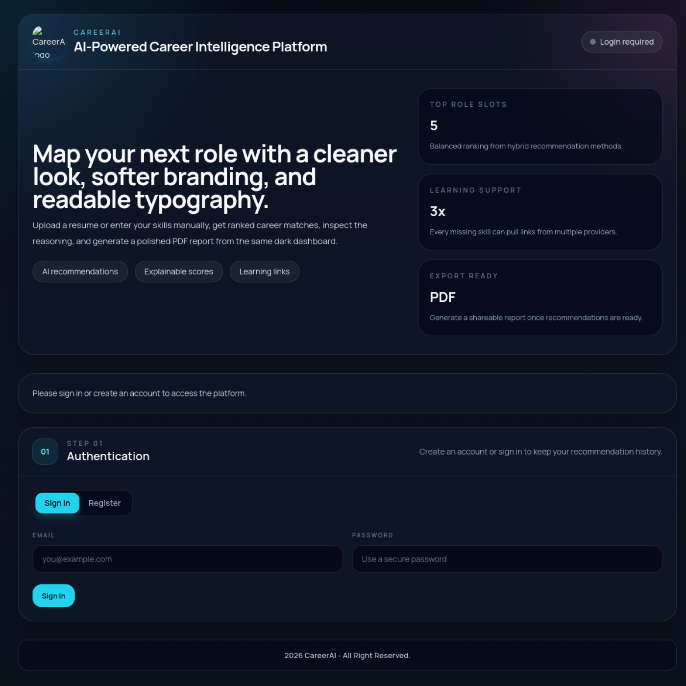
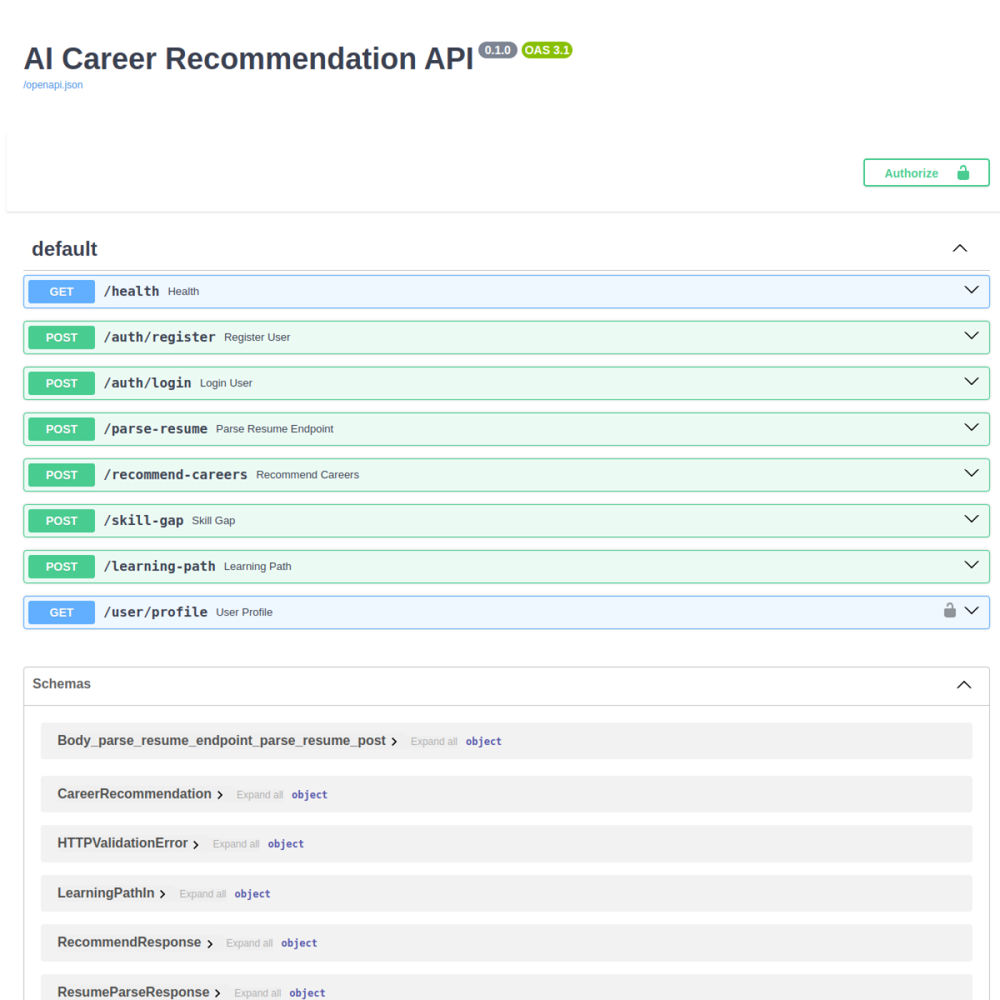

# AI Career Recommendation Platform

Production-ready AI career guidance platform that parses resumes, recommends role matches, explains ranking logic, and generates targeted upskilling paths.

## Live Links
- Frontend: https://gandharr.github.io/ai-career-platform/
- Backend API: https://ai-career-platform-api.onrender.com
- API Docs (Swagger): https://ai-career-platform-api.onrender.com/docs

## Screenshots

### Dashboard (GitHub Pages)


### Backend API Docs (Render)


## Core Features
- Resume parsing for `.pdf`, `.docx`, `.txt`
- Taxonomy-wide skill extraction and normalization (tech + non-tech)
- Hybrid recommendation engine (content + overlap + semantic)
- Explainability per role (matched/missing skills + method scores)
- Skill-gap analysis with learning resource suggestions
- JWT authentication (register/login) with protected user profile routes
- Account-gated dashboard experience
- PDF export of recommendation results

## Tech Stack
- Frontend: React, Tailwind CSS, Recharts, jsPDF
- Backend: FastAPI, scikit-learn, RapidFuzz, SQLAlchemy
- Databases:
  - PostgreSQL (Neon): users + recommendation logs
  - MongoDB (Atlas): recommendation history events
- Auth: JWT bearer token flow
- CI/CD: GitHub Actions (CI + GitHub Pages deploy)
- Local runtime: Docker Compose

## Architecture
- `frontend/`: Dashboard UI, auth flow, charts, PDF export
- `backend/app/main.py`: API routes + orchestration layer
- `backend/app/services/`: resume parser, recommender, skill gap, XAI, resources
- `backend/app/models.py`: SQLAlchemy models (`users`, `recommendation_logs`)
- `backend/app/data/taxonomy.py`: career-role skill taxonomy

## Run Locally with Docker (Recommended)
```bash
cd ai-career-platform
docker compose up --build
```

- Frontend: http://localhost:5173
- Backend Docs: http://localhost:8000/docs

## Run Locally without Docker

### Backend
```bash
cd backend
pip install -r requirements.txt
uvicorn app.main:app --reload
```

### Frontend
```bash
cd frontend
npm install
npm run dev
```

## Demo Scripts (Windows PowerShell)

### One-click demo
```powershell
./scripts/demo.ps1
```

This command:
1. Builds and starts containers
2. Waits for health checks
3. Seeds demo data
4. Runs smoke tests
5. Opens frontend and API docs

### Cleanup/reset
```powershell
./scripts/cleanup.ps1
```

## API Endpoints
- `POST /auth/register`
- `POST /auth/login`
- `POST /parse-resume`
- `POST /recommend-careers`
- `POST /skill-gap`
- `POST /learning-path`
- `GET /user/profile` (requires bearer token)

## Deployment Model

GitHub Pages hosts only static frontend assets. Full production uses:
- Frontend: GitHub Pages
- Backend: Render
- PostgreSQL: Neon
- MongoDB: Atlas

Required environment variables:
- Backend: `POSTGRES_URL`, `MONGO_URL`, `MONGO_DB_NAME`, `SECRET_KEY`, `CORS_ORIGINS`
- Frontend: `VITE_API_URL`

## Recommendation Formula (Presentation-friendly)

`final = 0.55 * content + 0.30 * overlap + 0.15 * semantic`

Fallback mode supports broad/non-tech resumes by still returning likely roles when strict normalized overlap is low.
